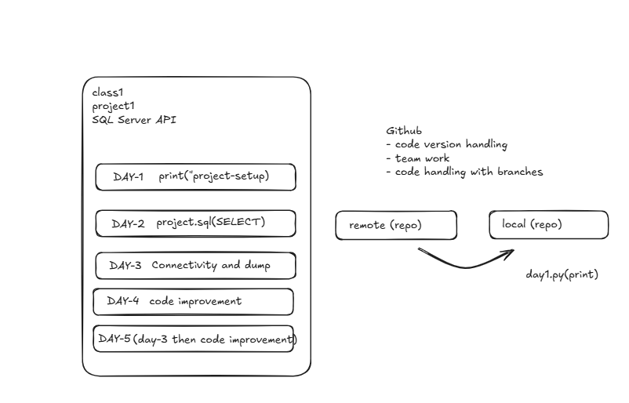

this  is a readme file
NOTES: 
exclidraw:https://excalidraw.com/#json=QGjePTq_aCFunYZrYkY74,zYtdIwX7PSNbBENEe95UWQ

## METHOD_1 CLONING

- git clone <your github link>
- git config --global user.email "" (first time only)
- git config --global user.name ""  (first time only)
- git config user.email (for checking the email)
- git config user.name  (for checking the name) 
- git status (untracked file hai)
- git add <file-name>  or git add <file-name> <file-name> or git add .
- git commit -m "<any message>" (for writing message)
- git push -u origin main 

## METHOD-2 WITHOUT CLONING

- create a local folder i:e., local-copy
- got into that folder and open git bash
- git init(will create .git folder)
- echo "this is a reademe file" >> README.md
- echo "this is a python file" >> day1.py
- git status
- git remote add origin <remote repo URL>
- git add .(to add all files)
- git commit -m "<any message>"
- git branch -M main
- git push -u origin main
